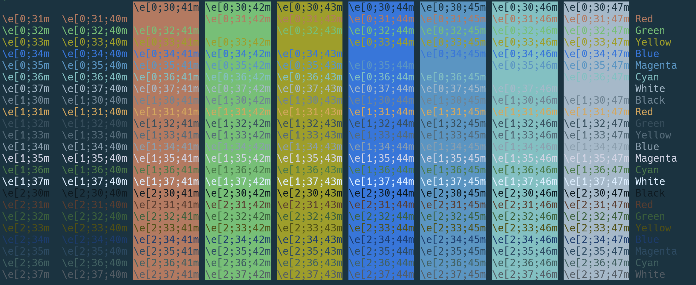

# Base16 - Nono

Nono is a theme created for [Base16](https://github.com/chriskempson/base16).
See the Base16 project for instructions on how to use it.

Nono leans dark blue/green, generally tends to use cool colors and eschew
bright colors (except for red).  I find it works equally well in good or
dark lighting conditions.

Screenshots below:

## colortest

## Credits

Thanks to [ColorKit](https://colorkit.co/) for helping with the
[nono-dark.yaml](palettes).

